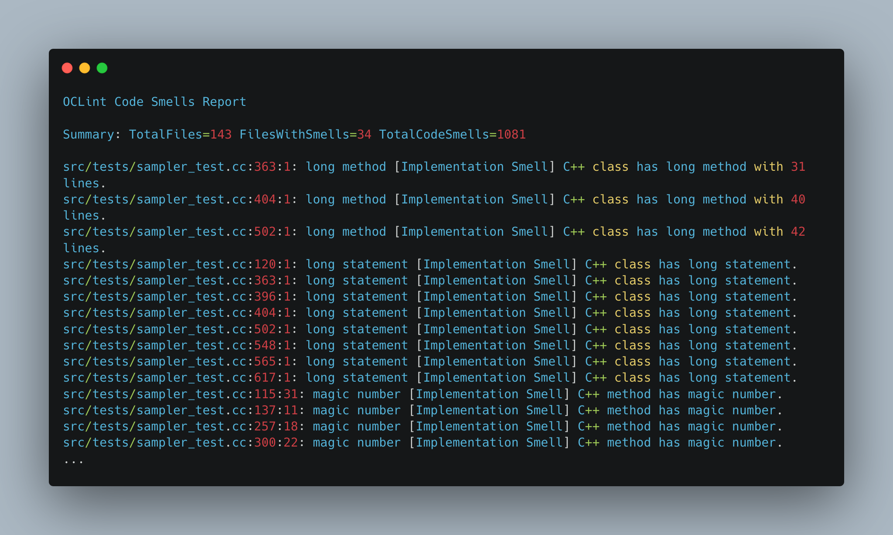

# CLEAN++

CLEAN++ is an extension of [OCLint](https://github.com/oclint/oclint), a static code analysis tool, to be able to detect 35 code smells in C++ code.

## Table of Contents
- [List of Code Smells](#list-of-code-smells)
- [How to run CLEAN++](#how-to-run-clean)
  - [Dependencies](#dependencies)
  - [Install](#install)
  - [Execution](#execution)
  - [Report](#report)
- [Experiments](#experiments)
  - [Setting up docker container](#setting-up-docker-container)
  - [Running CLEAN++ on Test Cases](#running-clean-on-test-cases)
    - [List of Test Cases](#list-of-test-cases)
    - [Replicate experiments](#replicate-experiments)
    - [Results](#results)
  - [Running CLEAN++ on Projects](#running-clean-on-projects)
    - [List of Projects](#list-of-projects)
    - [Replicate experiments](#replicate-experiments-1)
    - [Results](#results-1)

## List of Code Smells

CLEAN++ implements 35 code smells derived from the smells in DesigniteJava and Organic tools.
You can find the full details about each smell in [smells.md](data/smells.md)

| | | | | |
|--------------------------|-----------------------------------------|---------------------|------------------------------|------------------------|
| ImperativeAbstraction    | InsufficientModularization              | Long Method         | Data Class                   | Speculative Generality |
| MultifacetedAbstraction  | HubLikeModularization                   | Long Parameter List | Complex Class                | Brain Class            |
| UnnecessaryAbstraction   | Abstract Function Call From Constructor | Long Statement      | Refused Bequest              | Brain Method           |
| UnutilizedAbstraction    | Complex Conditional                     | Magic Number        | Spaghetti Code               | Dispersed Coupling     |
| DeficientEncapsulation   | Complex Method                          | Missing default     | Large Class                  | Intensive Coupling     |
| UnexploitedEncapsulation | Empty catch clause                      | Lazy Class          | Class Data Should Be Private | Message Chain          |
| BrokenModularization     | Long Identifier                         | Swiss Army Knife    | God Class                    | Shotgun Surgery        |

## How to run CLEAN++?
### Dependencies
* A C++ compiler (such as GCC or Clang)
* CMake
* LLVM and Clang (version 3.4 or later)
* Python 3
* Ninja

### Install
```bash
cd src/oclint-script;
./remake-release
```

### Execution
To run CLEAN++ on a project in <path-to-project> make sure there is a compilation database inside <path-to-project> of the format compile-command.json.
Then, run the following commands, where <rule name> is the name of the code smells you pretend to detect.
  
```bash
  cd build/oclint-release/bin
  ./oclint-json-compilation-database -p <path-to-project> -- -rule= <rule name>
```
  
To extract all 35 smells, run the RunAll script in oclint-scripts.
  
```bash
  cd oclint/scripts
  ./RunAll <path-to-project>
```
#### Notes
* Before running the smells on new project, it is necessary to run these rules on your project in this order: AggregateInfo, MethodsInfo, NumOfFanIn, NumOfFanInFunctions.
* These rules created four files in the /tmp/ directory (Data, Methods, NumOfFanIn, NumOfFanInFunctions). If you want to run on a new project, please delete those files first.

### Report
In the end, both execution types will output a report with the detected code smells for each file.
For example, [example_report.txt](data/example_report.txt) shows a full report for the execution of CLEAN++ on the project [gperftools](https://github.com/gperftools/gperftools).




  
## Experiments

### Setting up docker container
To replicate the experiments, you need to create a container with CLEAN++ installed.
Therefore execute the following commands from the root of the repository.

```bash 
docker build -t=cleanpp --progress=plain .
docker run -d --name=cleancpp cleanpp
```

### Running CLEAN++ on Test Cases
#### List of Test Cases
We evaluated CLEAN++ smells' implementations by writing 35 test cases, each targeting a specific test.
We include the written tests in the [test directory](tests/), for both [C++](tests/cpp) and [Java](tests/java).


#### Replicate experiments


#### Results
In [test_case_results.tsv](data/test_case_results.tsv), we list the results for each test case from the execution of CLEAN++ for C++ and both tools [DesigniteJava](https://www.designite-tools.com/) and [Organic](https://github.com/opus-research/organic).

In the following figure we show the comparison between the number of smells from the execution of CLEAN++ with the other two Java tools on the test cases for Java.


### Running CLEAN++ on Projects
#### List of Projects
We evaluated CLEAN++ on the 44 projects we list below.
You can find more information about them in [projects.tsv](data/projects.tsv)

|           |                    |             |               |                     |                  |           |
|-----------|--------------------|-------------|---------------|---------------------|------------------|-----------|
| WebServer | hnswlib            | FTXUI       | duckdb        | design-patterns-cpp | gperftools       | BlingFire |
| libco     | rpi-rgb-led-matrix | enkiTS      | re2           | zopfli              | ChaiScript       | PEGTL     |
| xlearn    | coost              | json        | git-crypt     | pugixml             | hardware-effects |           |
| mergerfs  | rpclib             | flatbuffers | yoga          | Dobby               | 2048             |           |
| OpenCC    | magic              | C-Plus-Plus | sentencepiece | PacVim              | kfr              |           |
| libfm     | matrix             | spdlog      | LeetCode      | SEAL                | marl             |           |
| cxxopts   | UDPspeeder         | muduo       | handy         | backward-cpp        | openal-soft      |           |

#### Replicate experiments

#### Results
We executed CLEAN++ on all of the 44 projects.
You can observe the results in [project_results.tsv](data/project_results.tsv).

In the following figure, you can observe the number of smells detected by CLEAN++ for each project.


